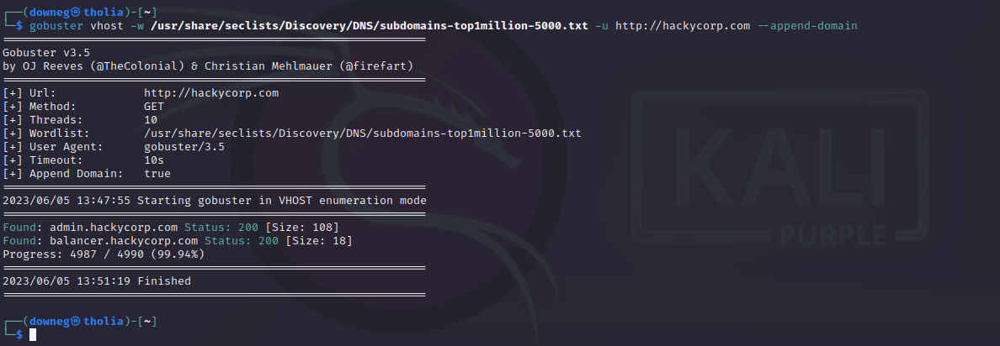
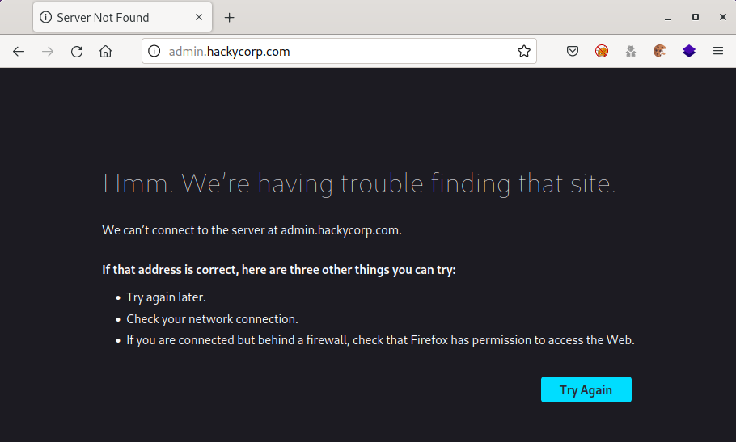
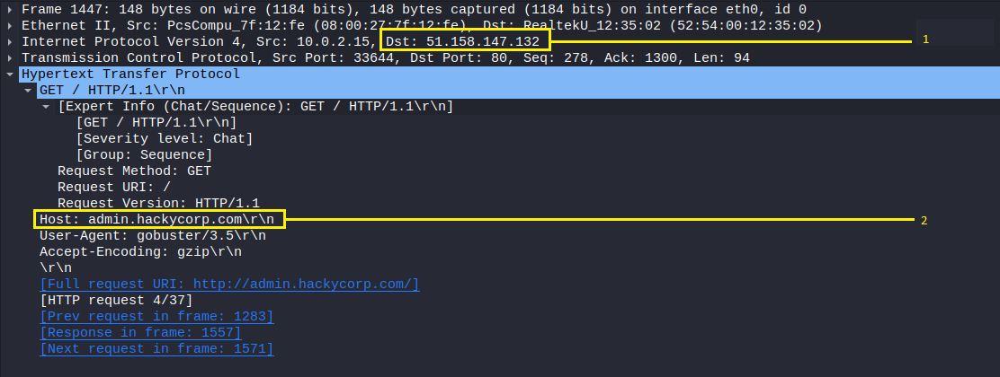
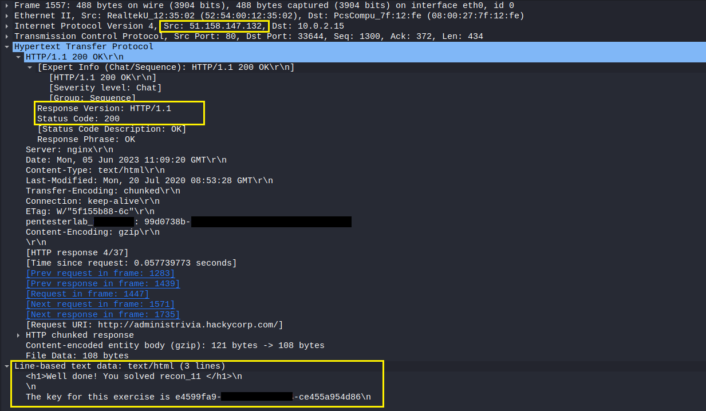

Virtual hosts:
---

Virtual hosting is a method for hosting multiple domain names on a single server (or pool of servers).
This allows one server to share its resources (i.e. memory and processor cycles) amongst many different web applications.
A common way to implement this is to use name-based virtual hosting where each separate application running on the web server cab be accessed using different values in the Host header of the HTTP request. 
Another benefit to name-based virtual hosting (other than server resource sharing) is that the same CA certificate can be used for multiple web applications when using SSL/TLS with wildcard certificates.

PentesterLab | Recon 11
---
OBJECTIVE: 
For this challenge, your goal is to brute a virtual host.

VIRTUAL HOST BRUTE FORCING:
In this challenge, you need to brute force a virtual host by only manipulating the Host header. 
There is no DNS resolution setup for this host. 
Therefore you will need to target hackycorp.com and bruteforce the virtual host (that ends in .hackycorp.com).

Brute forcing using gobuster:
---
Using gobuster we can brute force the name-based virtual hosts.
The subdomains-top1million-5000.txt wordlist is part of the popular SecLists wordlist package which can be downloaded from the Kali Linux repository: https://www.kali.org/tools/seclists/

This wordlist of 4989 possibilities finds two valid subdomains for hackycorp.com.
Since balancer.hackycorp.com is used in a separate exercise, we will concentrate on admin.hackycorp.com.

Testing the result in a web browser:
---

Why does this not work?
---

When the admin.hackysite.com address is put into the browser the browser will first try to resolve the hostname before sending any HTTP requests to the IP of the web server.
As noted in the exercise, there is no DNS resolution for this host.
We can prove this by looking at the packets sent by the browser to the DNS, and the response.

Why is gobuster is detecting the vhost:
---
Gobuster will first run a DNS query on the domain that we provided, in this case: http://hackycorp.com
Gobuster will then use each line of the wordlist provided to create a GET request, injecting the line from the wordlist (with the domain we provided appended) into the Host field of the HTTP header.
Since name resolution on the hackycorp.com domain is done before the virtual hose name is injected into the HTTP GET request, the GET request reaches our target server.

&nbsp;&nbsp; [1] The destination IP &nbsp;&nbsp; [2] The virtual host injected into the Host header.

How we can access the vhost:
---

Since the browser is failing to connect due to the lack of DNS resolution of the virtual host, we can add an entry to our hosts file.
This will allow the browser to resolve admin.hackycorp.com without dependance on a DNS server.

The exercise task however asks us to access the virtual host by only manipulating the Host header.
Gobuster has already done this for us as we can see the exercise key in the HTTP GET response packet.

Alternative methods would be to use curl to modify the Host header, or to capture a request to http://hackycorp.com in a penetration testing web proxy such as Burp Suite or ZAP and modify the Host header in the proxy.

